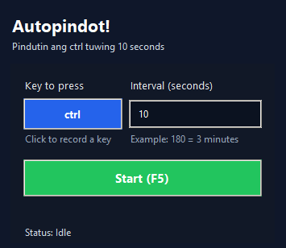

# 🤖 Autopindot 

- A simple windows automation tool that automatically presses a specified key at regular intervals
- Perfect for preventing afk timeouts, keeping games active, or automating repetitive tasks.

## User Interface

  

## Features
- **Customizable key press**: Choose any key
- **Adjustable interval**: Set custom delays

## Installation

### For users (executable)
- Download the latest `Autopindot.exe` file from [Releases](https://github.com/0xChron/autopindot/releases/tag/v1.0.0)
- Right-click and select **"Run as Administrator"**

## Usage

1. **Select Key**: Click the blue button to choose which key to auto-press
2. **Set Interval**: Enter the delay (in seconds) between each key press
3. **Start/Stop**: 
   - Click the green "Start (F5)" button, OR
   - Press `F5` anywhere on your computer
4. **Wait**: The app has a 3-second startup delay
5. **Monitor**: Watch the status and countdown timer

## Changelog

See [CHANGELOG.md](CHANGELOG.md) for version history.

## Contributing

Contributions are welcome! Please feel free to submit a Pull Request.

**Disclaimer**: This tool is for educational purposes. Use responsibly and respect the terms of service of applications you use it with.